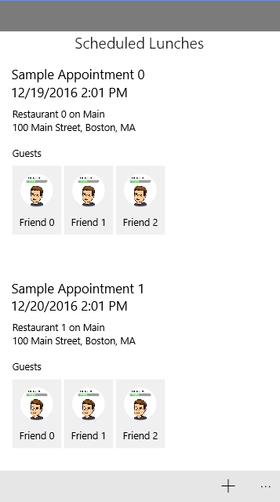

Lunch Scheduler Demo

This is a lunch scheduling example UWP app that demonstrates some features of UWP applications as well as usage of the UWP Community Toolkit.

--- 

### GuestDetailPage

**PC**

**MOBILE**

---

### LunchDetailsPage

**PC**

**Mobile**

--- 

### GuestsPage

**PC**

**MOBILE**

--- 

### LunchesPage

**PC**

**Mobile**

--- 

### RestaurantSearchPage

**PC**

**Mobile**

--- 

### AddLunchPage

**PC**

**Mobile**

--- 
